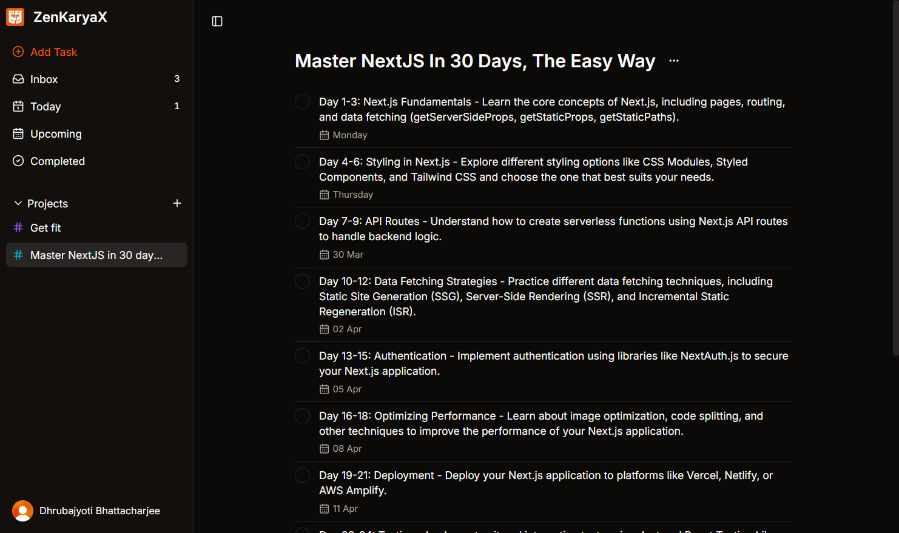

# ZenKaryaX - AI-Powered Task & Project Management Reinvented

<div align="center">
  
  <h3>AI-Powered Task & Project Management Reinvented</h3>
  <p>A modern, intuitive project management application with AI task generation</p>
</div>

<div align="center">
  
  [](https://reactjs.org/)
  [](https://ai.google.dev/)
  [](https://tailwindcss.com/)
  [](https://appwrite.io/)
  [](https://clerk.com/)
  [](https://www.apache.org/licenses/LICENSE-2.0)
  
</div>

---

## ✨ Features

ZenKaryaX helps you stay organized effortlessly with a rich set of features:

- **AI-Powered Task Generation** - Create task lists automatically using Google's Gemini AI
- **Intuitive Project Management** - Organize tasks into projects for better workflow
- **Smart Due Dates** - Natural language processing detects dates in your task descriptions
- **Multiple Task Views** - Inbox, Today, Upcoming, and Completed views
- **Secure Authentication** - Sign in with Google, GitHub, or email/password
- **Dark Theme** - Modern dark UI designed for focus and reduced eye strain
- **Toast Notifications** - Elegant notifications for important app events
- **Command Palette** - Keyboard-centric workflow with quick commands
- **Responsive Design** - Works seamlessly on desktop, tablet, and mobile
- **Real-time Updates** - Changes sync across devices instantly
- **Offline Support** - Keep working even when your connection is unstable

## Live Demo

[Play around!](https://zen-karya-x.vercel.app/)

## 🚀 Tech Stack

ZenKaryaX is built with a modern, powerful tech stack:

### Frontend

- **React 18** - Component-based UI library
- **TypeScript** - Type-safe JavaScript
- **Vite** - Next-generation frontend tooling
- **Tailwind CSS** - Utility-first CSS framework
- **shadcn/ui** - High-quality UI components
- **Lucide Icons** - Beautiful, consistent icon set
- **React Router** - Declarative routing
- **date-fns** - Date utility library

### Backend & Services

- **Clerk** - Authentication and user management
- **Appwrite** - Backend-as-a-Service (BaaS)
- **Google Generative AI (Gemini)** - AI model for task generation

### Utilities

- **chrono-node** - Natural language date parsing
- **clsx & tailwind-merge** - Conditional CSS utilities

## 📸 Screenshots

### Desktop View



_ZenKaryaX in action._

## 📱 Responsive Design

ZenKaryaX is designed to work flawlessly across all devices:

- **Mobile (< 640px)** - Optimized compact view with collapsible sidebar
- **Tablet (640px - 1024px)** - Enhanced layout with improved space utilization
- **Desktop (> 1024px)** - Full-featured experience with expanded workspace

## 🔒 Privacy & Security

- End-to-end encryption for sensitive data
- OAuth2 integration for secure third-party logins
- Regular security audits and updates
- No selling or sharing of user data

## ♿ Accessibility

ZenKaryaX is built with accessibility in mind:

- Semantic HTML structure
- ARIA attributes for screen readers
- Keyboard navigation support
- Color contrast compliance
- Focus indicators for interactive elements

## 🛠️ Installation & Setup

### Prerequisites

- Node.js 18 or higher
- npm or yarn
- Clerk account
- Appwrite account
- Google Generative AI API key

### Environment Variables

Create a `.env` file in the root directory with the following variables:

```
VITE_CLERK_PUBLISHABLE_KEY=your_clerk_key
VITE_CLERK_SIGN_IN_FORCE_REDIRECT_URL=/app/inbox
VITE_CLERK_SIGN_UP_FORCE_REDIRECT_URL=/app/inbox
VITE_APPWRITE_PROJECT_ID=your_appwrite_project_id
VITE_GOOGLE_API_KEY=your_google_generative_ai_api_key
...
```

### Development

```bash
# Clone the repository
git clone https://github.com/KeepSerene/zen-karya-ai-task-todo-site.git
cd zen-karya-ai-task-todo-site

# Install dependencies
npm install

# Start the development server
npm run dev
```

### Production

```bash
# Build for production
npm run build

# Preview production build
npm run preview
```

## 👥 Authors

- **Dhrubajyoti Bhattacharjee** - _Creator & Lead Developer_ - [KeepSerene](https://github.com/KeepSerene)

## 🤝 Contributing

Contributions are welcome! Please feel free to submit a Pull Request.

1. Fork the repository
2. Create your feature branch (`git checkout -b feature/amazing-feature`)
3. Commit your changes (`git commit -m 'Add some amazing feature'`)
4. Push to the branch (`git push origin feature/amazing-feature`)
5. Open a Pull Request

## 📜 License

This project is licensed under the Apache License 2.0 - see the [LICENSE](LICENSE) file for details.

## 🙏 Acknowledgements

- [shadcn/ui](https://ui.shadcn.com/) for the amazing UI components
- [Clerk](https://clerk.com/) for authentication services
- [Appwrite](https://appwrite.io/) for backend services
- [Google Generative AI](https://ai.google.dev/) for the Gemini AI integration
- [React](https://reactjs.org/) and the entire React ecosystem
- All open-source contributors whose libraries made this project possible

---

<div align="center">

Made with ❤️ by Dhrubajyoti Bhattacharjee

</div>
